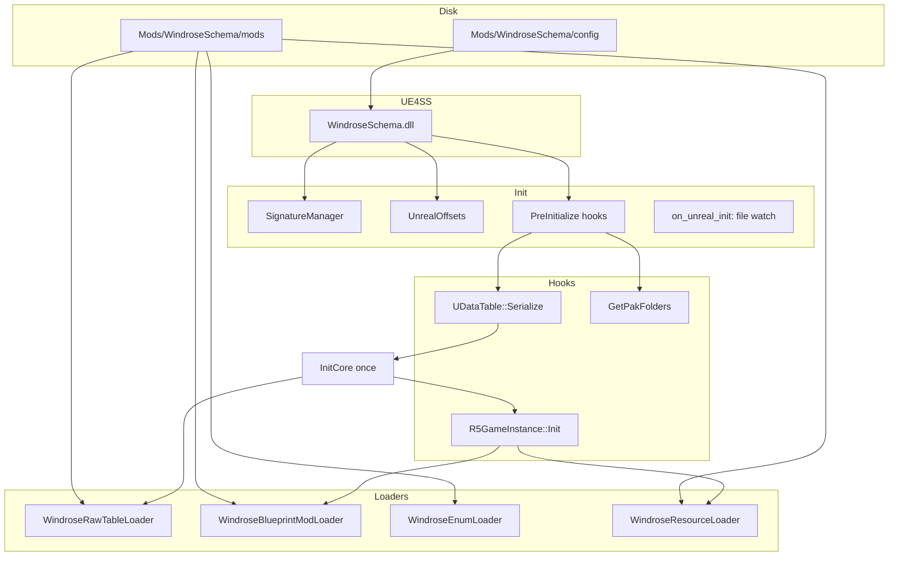

# WindroseSchema — Project architecture and usage

This document describes what this repository builds, how the runtime fits together, where content lives on disk, and how to use the compiled mod. For step-by-step mod authoring, see the [modder documentation](https://okaetsu.github.io/WindroseSchema/docs/gettingstarted). For install steps aligned with releases, see [installation](https://okaetsu.github.io/WindroseSchema/docs/installation).

---

## What this project is

**WindroseSchema** is a **UE4SS C++ mod** (a Windows DLL) for the game **Windrose**. It loads JSON-defined changes **at runtime** so multiple mods can alter the same underlying data tables and Blueprint defaults **without** each shipping conflicting patched game assets.

The public-facing idea (from the upstream project) is **JSON Schema** for mod files: schemas give editors autocompletion and validation while authoring. This repository is the **native loader** that applies those JSON files inside the live game.

---

## Repository layout (high level)

| Area | Role |
|------|------|
| `CMakeLists.txt` | Top-level CMake: C++23, target `WindroseSchema` (shared library), sources under `src/`, headers under `include/`. |
| `deps/CMakeLists.txt` | Pulls in **RE-UE4SS** (UE4SS as a library), **nlohmann/json**, **safetyhook**, **glaze**, **efsw**, plus UE4SS’s own transitive deps (e.g. Zydis). |
| `deps/RE-UE4SS/` | Git submodule: UE4SS SDK, patterns, and mod hosting APIs (`CppUserModBase`, logging, Unreal wrappers). |
| `src/` | Mod implementation: DLL entry, loaders, Unreal/SDK helpers, property/JSON bridging, file watching. |
| `include/` | Headers matching `src/`. |
| `version.h` | Semantic version exposed in the mod metadata (`VERSION_MAJOR` / `MINOR` / `REVISION`). |
| `README.md` | Short overview, links to docs, and CMake configure examples. |

Generated build trees (e.g. `build/`, `cmake-build-*`) are intentionally not committed; CMake produces them locally.

---

## What gets built

CMake defines a **single shared library** target named **`WindroseSchema`**.

- On Windows this becomes **`WindroseSchema.dll`** (exact output directory depends on your generator and build type, e.g. `build/Release/` or `build/` for Ninja).
- The DLL exports UE4SS’s C++ mod entry points `start_mod` and `uninstall_mod`, which construct and destroy a subclass of `RC::CppUserModBase`.

You do **not** get a checked-in Visual Studio `.sln` by default; that file is **generated** when you configure CMake with a Visual Studio generator (see `README.md`).

---

## Runtime stack

- **UE4SS**: Injects into the game process and loads `WindroseSchema.dll` as a C++ mod. The mod uses UE4SS types (`CppUserModBase`, `UE4SSProgram`, Unreal wrappers) and runs on the same rules as other UE4SS native mods.
- **safetyhook**: Inline hooks on native functions and vtable targets (e.g. `UDataTable::Serialize`, `UR5GameInstance::Init`, Blueprint/Actor paths) with a trampoline back to the original implementation.
- **Pattern / signature scanning** (via UE4SS’s scanner): Resolves addresses that move between game builds using byte patterns defined in `WindroseSignatures.h`.
- **nlohmann::json** + **glaze**: JSON parsing for mod files; glaze reads/writes the mod’s own `config.json`.
- **efsw**: Optional recursive filesystem watch for **auto-reload** when `config.json` enables it.

---

## Lifecycle inside the game

The mod class is defined in `src/dllmain.cpp` (type `WindroseSchema`). Important phases:

1. **Construction**  
   - Sets mod name/version/description.  
   - Loads `Mods/WindroseSchema/config/config.json` via `PS::PSConfig`.  
   - `Windrose::SignatureManager::Initialize()` — scans the main executable for all patterns in `WindroseSignatures.h`.  
   - `Windrose::UnrealOffsets::Initialize()` — game-specific offset/layout setup.  
   - `MainLoader.PreInitialize()` — installs early hooks (see below).

2. **`on_unreal_init`**  
   - `WindroseMainLoader::Initialize()` — if auto-reload is enabled, starts watching `Mods/WindroseSchema/mods`.

3. **`on_ui_init`**  
   - If UE4SS’s debug GUI console is enabled, registers an empty **“Windrose Schema”** tab placeholder (no UI logic yet in the snippet present in `dllmain.cpp`).

Core loading logic lives in **`WindroseMainLoader`** (`src/Loader/WindroseMainLoader.cpp`).

### Hook: `UDataTable::Serialize`

- **Purpose**: Observe every data table as Unreal serializes it, register it by name, and **apply queued JSON patches** at the right time.  
- **Failure mode**: If the pattern for `UDataTable::Serialize` fails, the mod logs an error and the “core” path does not initialize.

On the first serialize callback, **`InitCore()`** runs once:

- Initializes `StaticClassStorage`.  
- Runs **PostEngineInit** mod pipeline: `InitializeMods` + `LoadMods` for that phase.  
- Hooks **`UR5GameInstance::Init`** (class path `/Script/R5.R5GameInstance`, vtable index **90** in current code) so **GameInstanceInit** work runs when the game instance comes up.

### Hook: `FPakPlatformFile::GetPakFolders` (optional)

- After calling the original, appends the absolute path `…/Mods/WindroseSchema/mods/` (with trailing slash) to UE’s pak search list.  
- Lets each schema mod ship **`.pak` files** under e.g. `Mods/WindroseSchema/mods/<YourMod>/paks/` without manual engine config.  
- If the signature fails, extra pak folders are skipped (logged as error).

### Data table registry

`UECustom::UDataTableRegistry` (`src/SDK/Classes/Custom/UDataTableStore.cpp`):

- When the core initializes, it can bulk-index existing `UDataTable` objects (`Initialize()`), and **each serialize** also registers the table by name.  
- Each **`WindroseModLoaderBase`** registers a callback so its `OnDatatableSerialized` runs whenever a table is seen—used heavily by **`WindroseRawTableLoader`** to merge JSON into live rows.

---

## Mod loader architecture

`WindroseMainLoader::CreateLoaders()` currently registers **four** loaders (in order):

| Loader | Subfolder under each mod | When it initializes | What it does |
|--------|---------------------------|---------------------|----------------|
| **`WindroseResourceLoader`** | `resources/` | `GameInstanceInit` | Under `resources/images/`, imports `.png`, `.jpg`, `.jpeg`, `.bmp`, `.tga` as textures, roots them, renames into a transient package path `WindroseSchema/Resources/<modName>/<imageName>`. Supports auto-reload per file. |
| **`WindroseEnumLoader`** | `enums/` | `PostEngineInit` | At init, maps all `UEnum` objects by short name. JSON files list new enum display names to **insert** into existing `EWindrose…` enums (runtime extension). |
| **`WindroseRawTableLoader`** | `raw/` | `PostEngineInit` | At **PostEngineInit**, reads all `*.json` / `*.jsonc` in `raw/` and merges them into an internal map keyed by **data table name**. On each **`UDataTable::Serialize`**, applies patches: add row, edit row, delete row (`null`), wildcard keys containing `*` for bulk edits, and special handling for **`UCompositeDataTable`** (applies to parent tables whose names end with `_Common`). Uses `PropertyHelper::CopyJsonValueToContainer` to write JSON into row structs. |
| **`WindroseBlueprintModLoader`** | `blueprints/` | `PostEngineInit` (hooks only) | Hooks **`UBlueprintGeneratedClass::PostLoad`** (vtable index **19**) and **`AActor` “PostInitializeComponents”** (vtable index **169**) to apply JSON to **CDOs** and **actor instances**. **PostEngineInit** pass loads JSON for assets **not** starting with `/Game/` (short names / FName keys). **GameInstanceInit** (and auto-reload) loads `/Game/...` paths, resolves them to `ClassName.ClassName_C`, loads the asset blocking, then applies JSON properties—including **inheritable components** and **simple construction script** component templates when object properties are null. |

**Engine lifecycle enum** (`WindroseModLoaderBase`): `PostEngineInit` vs `GameInstanceInit` gates which pass runs for each loader; `PreInitialize` hooks are separate from this enum.

### Auto-reload

If `config.json` has `enableAutoReload: true`, `FileWatchWrapper` watches `Mods/WindroseSchema/mods` recursively. On add/modify of a file, `AutoReload` parses the path, expects at least `…/WindroseSchema/mods/<modName>/<folderType>/…`, dispatches to the loader whose `GetModFolderType()` matches `folderType` (`raw`, `blueprints`, `resources`, `enums`), and schedules work on the **game thread** via `UECustom::AsyncTask`.

---

## On-disk paths (relative to UE4SS working directory)

All of the following are under whatever **`UE4SSProgram::get_program().get_working_directory()`** resolves to for your install (typically the game’s `Win64` folder or the UE4SS root next to the executable—follow UE4SS docs for your game).

| Path | Purpose |
|------|---------|
| `Mods/WindroseSchema/config/config.json` | Mod settings (glaze JSON): `languageOverride`, `enableAutoReload`, `enableDebugLogging`. Created on first run if missing. |
| `Mods/WindroseSchema/mods/<ModName>/raw/*.json` | Raw data table patches. |
| `Mods/WindroseSchema/mods/<ModName>/enums/*.json` | Enum additions. |
| `Mods/WindroseSchema/mods/<ModName>/blueprints/*.json` | Blueprint / CDO / component JSON. |
| `Mods/WindroseSchema/mods/<ModName>/resources/images/*` | Runtime-imported textures. |
| `Mods/WindroseSchema/mods/<ModName>/paks/*.pak` | Optional; discovered because the extra pak directory is the **mods** root (place per-mod pak subfolders as you package). |

---

## Signatures and game updates

Several features depend on **AOB (byte) signatures** in `include/SDK/WindroseSignatures.h`, not only exports. When Windrose ships a patch that changes codegen, signatures or **vtable indices** (Blueprint `PostLoad`, `AActor` post-init, `R5GameInstance::Init`) may fail. Symptoms: errors in the UE4SS console, missing pak folder injection, or blueprint/raw application not running.

Updating the mod for a new build usually means **refreshing patterns and vtable slots** using a disassembler or UE4SS tooling, then rebuilding.

---

## Other source files worth knowing about

- **`src/Loader/Windrose*ModLoader.cpp`** (e.g. monster, item, skin, spawn): Additional loader implementations exist in the tree, but **`WindroseMainLoader::CreateLoaders()` does not register them** in the current code path—they are **not active** unless wired in later.  
- **`src/Tools/EnumSchemaDefinitionGenerator.cpp`**: Utility to dump `EWindrose*` enums to `enum_definitions.json` for schema authoring. It is **compiled into the DLL** but **nothing in `dllmain.cpp` calls it**; it is intended for developer-driven use if you hook it or call it from a one-off entry point.  
- **`include/Utility/Logging.h`** / **`PS::Log`**: Thin logging wrapper over UE4SS log levels.  
- **`SDK/Helper/PropertyHelper`**: Bridges JSON values into `FProperty` data on UObject/UClass/table rows.

> **Important:** `PropertyHelper::GetNextField` reads `FField::Next` at offset `0x20`, but this game build (UE5 5.6.1-0) has `Next` at `0x18`. Any code that walks the property linked list via `GetNextField` will crash after the first field. Use `PropertyHelper::GetPropertyByName(UScriptStruct*, name)` to look up fields by name instead. See **`PROPERTY_ACCESS_GUIDE.md`** for the full analysis, safe patterns, and verified memory layouts.

---

## Building (summary)

Prerequisites and full steps are in **`README.md`** and [UE4SS build requirements](https://docs.ue4ss.com/#build-requirements). In short:

1. Satisfy UE4SS toolchain prerequisites (MSVC, Rust where UE4SS needs it, Epic-linked GitHub for UE sources if your UE4SS fork requires it).  
2. `git submodule update --init --recursive`  
3. Configure CMake (Visual Studio or Ninja + `CMAKE_BUILD_TYPE` as in README).  
4. Build the `WindroseSchema` target.

Artifact: **`WindroseSchema.dll`**.

---

## How to use after compile

### 1. Install UE4SS for Windrose

Follow the current UE4SS + Windrose instructions (game version-specific). UE4SS must load successfully **before** this mod matters.

### 2. Install the DLL as a C++ mod

Place the built **`WindroseSchema.dll`** according to **UE4SS C++ mod layout** for your game version (folder name usually matches the mod; this project expects resources under **`Mods/WindroseSchema/`**—see `PSConfig::GetConfigPath` and `WindroseMainLoader::GetModsPath` in `src/Utility/Config.cpp` and `src/Loader/WindroseMainLoader.cpp`).

The exact DLL path relative to `Win64` can vary by UE4SS version; if unsure, use the [installation guide](https://okaetsu.github.io/WindroseSchema/docs/installation) or UE4SS “C++ mods / `CppUserModBase`” documentation.

### 3. Create the mod data tree

Under `Mods/WindroseSchema/`:

- Add **`config/config.json`** (or launch once to generate defaults).  
- Add **`mods/<YourPackName>/`** with the subfolders you need (`raw`, `blueprints`, `enums`, `resources`, `paks`).

### 4. Run the game

Watch the UE4SS log / debug console:

- Signature scan lines (`Found UDataTable::Serialize: …`).  
- `Loader 'raw' initialized.` etc.  
- Per-mod `Loading mod: …` and per-table apply summaries from `WindroseRawTableLoader`.

### 5. Optional: auto-reload during development

Set `enableAutoReload` to true in `config.json`. Edit JSON under `mods/…` and save; the mod attempts to reapply the changed file on the game thread.

---

## Mental model (one diagram)

---

## References

- [WindroseSchema — Getting started (modders)](https://okaetsu.github.io/WindroseSchema/docs/gettingstarted)  
- [WindroseSchema — Installation](https://okaetsu.github.io/WindroseSchema/docs/installation)  
- [UE4SS documentation](https://docs.ue4ss.com/)  
- Raw table JSON shape and pitfalls (e.g. not wrapping rows in a top-level `Rows` key): see log message in `WindroseRawTableLoader.cpp` and the linked **raw tables** guide on the GitHub Pages site.

---

*This file was written to match the repository layout and code paths as of the `version.h` in this tree (`0.6.0`). If behavior diverges after refactors, prefer the source under `src/Loader/` and `src/dllmain.cpp` as the source of truth.*
